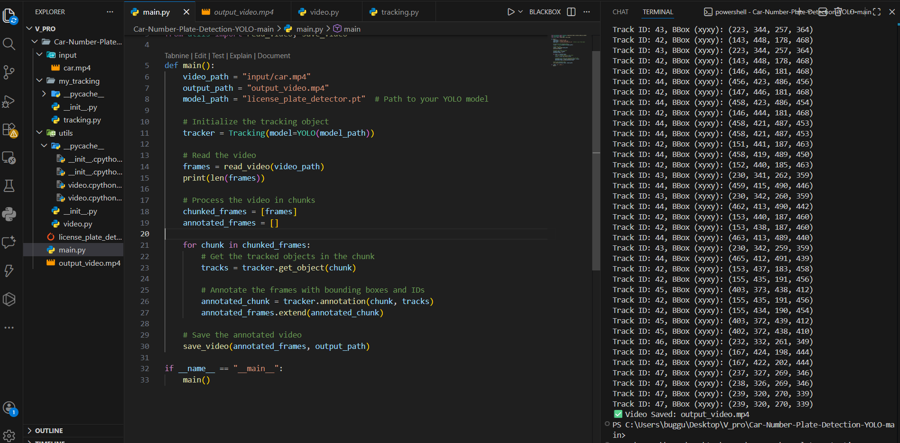

# 🚗 Vehicle Number Plate Detection & Tracking using YOLO

This project performs **automatic vehicle number plate detection and tracking** from a video using **YOLO (Ultralytics)** and **ByteTrack**.

The system reads an input video, detects number plates frame-by-frame, tracks them across frames, and saves an annotated output video.

---

## 📌 Features

- 🔍 Number Plate Detection using YOLO
- 🎯 Multi-Object Tracking using ByteTrack
- 🎥 Video Frame Processing Pipeline
- 🟩 Bounding Box Visualization
- 💾 Annotated Output Video Generation
- ⚡ Chunk-based Video Processing (memory efficient)

---

## 🖼️ Output Preview
| Detection Example                  |
| ---------------------------------- |


---

## 📸 Output Sample

Add screenshots inside `assets/` folder.

| Detection Code                  |
| ---------------------------------- |
|  |

---

## 📂 Project Structure

```
Car-Number-Plate-Detection-YOLO/
│
├── input/
│   └── car.mp4
│
├── my_tracking/
│   ├── __init__.py
│   └── tracking.py
│
├── utils/
│   ├── __init__.py
│   └── video.py
│
├── license_plate_detector.pt
├── main.py
├── output_video.mp4
└── README.md
```

---

## ⚙️ Installation

Clone the repository:

```
git clone https://github.com/your-username/vehicle-number-plate-detection.git
cd vehicle-number-plate-detection
```

Install dependencies:

```
pip install ultralytics supervision opencv-python numpy
```

---

## ▶️ Usage

Run the pipeline:

```
python main.py
```

Output video will be saved as:

```
output_video.mp4
```

---

## 🧠 How It Works

1. Input video is read frame-by-frame
2. Frames are processed in chunks
3. YOLO detects number plates
4. ByteTrack assigns track IDs
5. Bounding boxes are drawn
6. Output video is saved

---

## 🚀 Future Improvements

- 🔤 OCR for number plate text recognition
- 📊 Save detection logs to CSV / Database
- 🎥 Real-time webcam detection
- 🌐 Deploy as Flask / Streamlit Web App

---

## 👨‍💻 Author

--- Dheeraj Kumar ---
Gmail: sharmajidheeraj786@gmail.com

---
